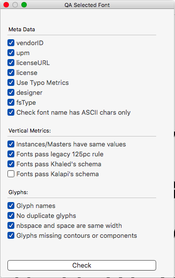
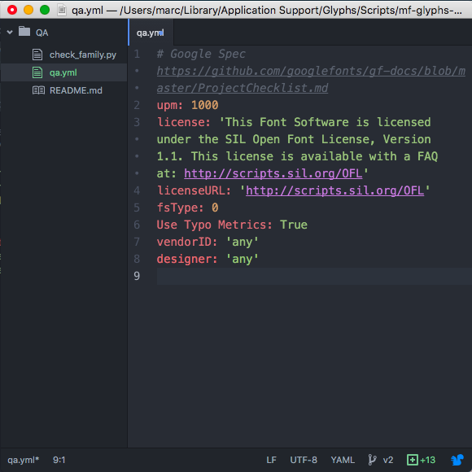

# Glyphsapp Font QA

Test your .glyphs file's metadata against a custom configuration file and for common errors.

This tool is useful Foundries and individuals who have font metadata which should remain consistent across releases.

## Configuration file

Place your custom metadata into *qa.yml*

The following fields are accepted:
- copyright
- designer
- designerURL
- manufacturer
- manufacturerURL
- versionMajor
- versionMinor
- date
- familyName
- upm
- license
- licenseUrl
- glyphOrder
- Family Alignment Zones
- panose
- fsType
- unicodeRanges
- codePageRanges
- vendorID
- blueScale
- blueShift
- isFixedPitch
- trademark
- description
- sampleText
- license
- licenseURL
- versionString
- uniqueID
- ROS
- Make morx table
- EditView Line Height
- Compatible Name Table
- Name Table Entry
- GASP Table
- localizedFamilyName
- localizedDesigner
- TrueType Curve Error
- Use Typo Metrics
- Has WWS Names
- Use Extension Kerning
- Don't use Production Names
- makeOTF Argument
- note
- Disable Subroutines
- Disable Last Change
- Use Line Breaks

Spelling must be exact.

## Further QA tests
Apart from testing metadata, the tool also checks:

### Misc:
- Font names don't contain non ASCII characters

### Glyphs:
- Report duplicate glyphs
- Space and nbspace share same width
- Glyphs which shouldn't be empty have either components or paths

### Vertical Metrics:
- Master/instances share the same vertical metrics

## How did this project start?
The Google Fonts collection is currently over 800 fonts. We needed a way to quickly assess if certain families are not meeting our new specification.

## Want to contribute?
By all means submit an issue or pull request.
